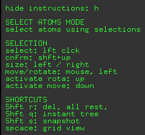

[//]: # (Badges)
[](https://github.com/rinikerlab/restraintmaker/actions/workflows/autoTest.yml)


# Welcome to RestraintMaker

RestraintMaker is a tool that allows automatic distance restraint assignment for dual-topology relative free energy (RFE) calculations.
The package can be used either in a scripting mode or with a GUI-based in PyMOL(see [1]). 

## Introduction
Thanks to the methodological, software and harware improvements of recent years, RFE calculations are able to tackle more and more complex transformations. This also causes a growing need for more efficient setups of such calculations, namely automatization. Our aim is to provide a link in the automatization chain which can be integrated into workflows for RFE calculations.
RestraintMaker contains a greedy approach to determine good placements of atom distance and/or position restraints based on geometric measures. It can be used to generated distance/position restraints for RFE calculations with a dual state approach, such as TI. Further, it can be used to generate distance/position restraints for multistate methods such as Replica Exchange Enveloping Distribution Sampling (RE-EDS) [3,4].

For more details on the history of distance restraints in RFE calculations, the algorithm of RestraintMaker and an application to the calculation of relative hydration free energies you can checkout (in the near future): Ries, B.; Rieder, S.R.; Rhiner, C.; Hünenberger, P.H.; Riniker, S. - A Graph-Based Approach to the Restraint Problem in Dual Topology Approaches with RestraintMaker. to be submitted

## Content
### Development
RestraintMaker is split two parts:

* RestraintMaker
  This part is the core of the program. It can be executed as standalone.
    * algorithm: restraint selecting algorithms
    * tools_Rdkit: additional functions for filtering or selecting (see [2])
    * io: writing/importing outputfiles
    * utils
    
* Interface PyMOL:
    Allows interfacing to PyMOL and generates the GUI-Expierence (see [1])
    
## Installation
You can retrieve the repository from GitHub:
https://github.com/rinikerlab/restraintmaker

  * Install via Pymol Plugin Manager 
      
      **coming soon**

  * Install with Anaconda

```
#!/usr/bash
# 1. Retrieve the repository
git clone https://github.com/rinikerlab/restraintmaker.git
cd restraintmaker
        
# 2. activate submodules
git submodule init
git submodule update

# 3. generate an Anaconda environment with the environment file and add the repository to its path:       
conda env create --file devtools/conda-envs/dev_env.yaml -n restraintmaker
conda develop -n restraintmaker /absolute_path/to/restraintmaker

# 4. Test    
conda activate restraintmaker
python examples/example_gui.py
```

## GUI Tutorial
### GUI Menu
RestraintMaker adds a menu to the pymol GUI on the bottom right. This is the easiest way to interact with RestraintMaker.


### GUI Instructions
On the top left you'll find some helpful instructions and hot keys for RestraintMaker



### Optimized Distance Restraints
#### Start by loading
Please follow the installation instructions above. Then, you can load the pymol GUI with an example system using

```
python examples/example_gui.py
```


#### Select \& Filter
By checking `atoms` and `select` in the "Selection Options" of the RestraintMaker menu, you can define which atoms are eligible to be picked for distance restraints. There are several modes to select atoms for this:

  * `SingleAtomSelection`: click on an atom to add it to your selection
  * `AllSelection`: select all atoms
  * `MCSSelection`: select the atoms of the maximum common substructure, as found by pymol
  * `SphericalSelection`: select all atoms within a sphere (see instructions on top left for tips on how to modify the sphere)

After choosing your initial selection, you can modify it by applying filters:

  * `PropertyFilter`: submit a pymol Atom property and value to filter
  * `ElementFilter`: specify one or several element types
  * `RingFilter`: atoms in rings
  


#### Optimize restraints

To generate the distance restraints, there are two methods:

  * `GreedyGraphOptimizer`: the greedy min-max algorithm
  * `BruteForceRingOptimizer`: brute force approach (optimal solution, but potentially slow)

For both methods you can either use the default parameters or chose your own. Parameters are e.g. the number of restraints to choose per molecule pair.


#### Export restraints to files

After generating your distance restraints, you can export them in one of the following formats:

  * `Gromos_Distance_Restraints`: GROMOS format
  * `Gromacs_Distance_Restraints`: GROMACS format
  * `JSON_Distance_Restraints`: JSON format which can be easily parsed and converted to the format of your choice


## Author
Benjamin Ries (@SchroederB), Salomé R. Rieder (@SalomeRonja), Clemens Rhiner (@ClemensRhiner)
    
## Acknowledgments
The authors want to thank Carmen Esposito and Dominik Sidler for the great discussions.
Project based on the 
[Computational Molecular Science Python Cookiecutter](https://github.com/molssi/cookiecutter-cms) version 1.3.

## References
[1] The PyMOL Molecular Graphics System, Version 2.5 Schrödinger, LLC.  (Anaconda OpenSource Version)

[2] **RDKit**: **Cheminformatics** and machine learning software (2021) - http://www.rdkit.org

[3] Christ, C. D.; van Gunsteren, W. F. - Enveloping Distribution Sampling: A Method to
Calculate Free Energy Differences From a Single Simulation. J. Chem. Phys. 2007,
126, 184110. https://doi.org/10.1063/1.2730508

[4] Sidler, D.; Schwaninger, A.; Riniker, S. - Replica Exchange Enveloping Distribution Sam-
pling (RE-EDS): A Robust Method to Estimate Multiple Free-Energy Differences From
a Single Simulation. J. Chem. Phys. 2016, 145, 154114. https://doi.org/10.1063/1.4964781

## Copyright
Copyright (c) 2021, Benjamin Ries (@SchroederB), Salomé R. Rieder (@SalomeRonja), Clemens Rhiner (@ClemensRhiner)

